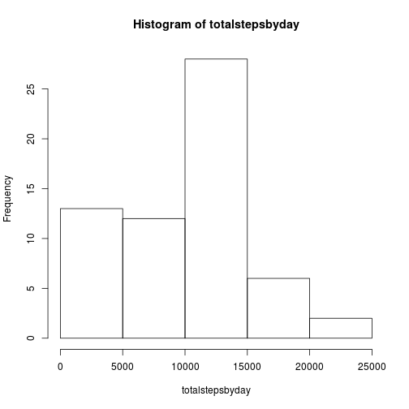
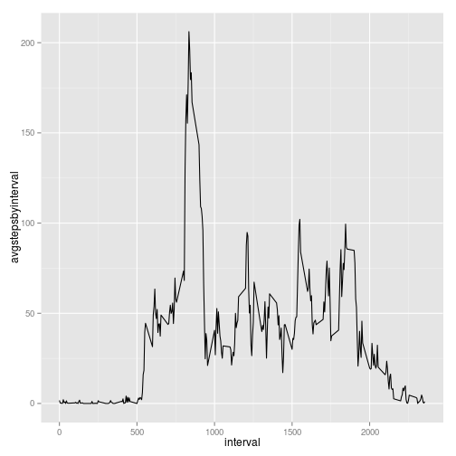
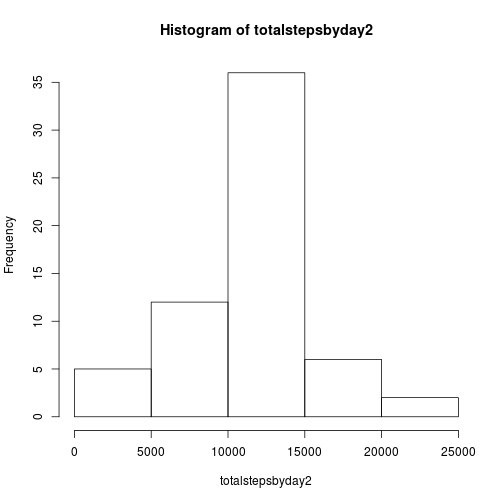

#Read in dataset

```r
library(dplyr)  
library(ggplot2)  
library(lattice)  
unzip("activity.zip")
activity<-read.csv("activity.csv")
head(activity)
```

```
##   steps       date interval
## 1    NA 2012-10-01        0
## 2    NA 2012-10-01        5
## 3    NA 2012-10-01       10
## 4    NA 2012-10-01       15
## 5    NA 2012-10-01       20
## 6    NA 2012-10-01       25
```

#What is mean total number of steps taken per day?  
##1.Calculate the total number of steps taken per day.  

```r
totalstepsbyday<-tapply(activity$steps,activity$date,sum,na.rm=TRUE)
head(totalstepsbyday)
```

```
## 2012-10-01 2012-10-02 2012-10-03 2012-10-04 2012-10-05 2012-10-06 
##          0        126      11352      12116      13294      15420
```
##2.Make a histogram of the total number of steps taken each day.

```r
hist(totalstepsbyday)
```

 

##3.Calculate and report the mean and median of the total number of steps taken per day.

```r
summary(totalstepsbyday)
```

```
##    Min. 1st Qu.  Median    Mean 3rd Qu.    Max. 
##       0    6778   10400    9354   12810   21190
```
#What is the average daily activity pattern?
##1.Make a time series plot (i.e. type = "l") of the 5-minute interval (x-axis) and the average number of steps taken, averaged across all days (y-axis)

```r
avgstepsbyinterval<-tapply(activity$steps,activity$interval,mean,na.rm=TRUE)
head(avgstepsbyinterval)
```

```
##         0         5        10        15        20        25 
## 1.7169811 0.3396226 0.1320755 0.1509434 0.0754717 2.0943396
```

```r
interval<-levels(factor(activity$interval))
interval<-as.numeric(interval)
head(interval)
```

```
## [1]  0  5 10 15 20 25
```

```r
qplot(interval,avgstepsbyinterval,geom = "line")
```

 

##2.Which 5-minute interval, on average across all the days in the dataset, contains the maximum number of steps?

```r
names(avgstepsbyinterval)[avgstepsbyinterval==max(avgstepsbyinterval)]
```

```
## [1] "835"
```

#Imputing missing values
##1.Calculate and report the total number of missing values in the dataset (i.e. the total number of rows with NAs)

```r
summary(activity$steps)
```

```
##    Min. 1st Qu.  Median    Mean 3rd Qu.    Max.    NA's 
##    0.00    0.00    0.00   37.38   12.00  806.00    2304
```

##2-3.Devise a strategy for filling in all of the missing values in the dataset. The strategy does not need to be sophisticated. For example, you could use the mean/median for that day, or the mean for that 5-minute interval, etc.Create a new dataset that is equal to the original dataset but with the missing data filled in.
###substitude missing values with average steps by interval across all days

```r
meandata<-data.frame(interval=names(avgstepsbyinterval),mean=avgstepsbyinterval)
head(meandata)
```

```
##    interval      mean
## 0         0 1.7169811
## 5         5 0.3396226
## 10       10 0.1320755
## 15       15 0.1509434
## 20       20 0.0754717
## 25       25 2.0943396
```

```r
meansteps<-avgstepsbyinterval[as.character(activity$interval)]
activity<-mutate(activity,meansteps=meansteps)
activity$steps<-as.numeric(activity$steps)
head(activity)
```

```
##   steps       date interval meansteps
## 1    NA 2012-10-01        0 1.7169811
## 2    NA 2012-10-01        5 0.3396226
## 3    NA 2012-10-01       10 0.1320755
## 4    NA 2012-10-01       15 0.1509434
## 5    NA 2012-10-01       20 0.0754717
## 6    NA 2012-10-01       25 2.0943396
```

```r
activity[is.na(activity$steps),1]<-activity[is.na(activity$steps),4]
head(activity)
```

```
##       steps       date interval meansteps
## 1 1.7169811 2012-10-01        0 1.7169811
## 2 0.3396226 2012-10-01        5 0.3396226
## 3 0.1320755 2012-10-01       10 0.1320755
## 4 0.1509434 2012-10-01       15 0.1509434
## 5 0.0754717 2012-10-01       20 0.0754717
## 6 2.0943396 2012-10-01       25 2.0943396
```

##4.Make a histogram of the total number of steps taken each day and Calculate and report the mean and median total number of steps taken per day. Do these values differ from the estimates from the first part of the assignment? What is the impact of imputing missing data on the estimates of the total daily number of steps?
###some total steps by day are getting closer to the mean of total steps by day

```r
totalstepsbyday2<-tapply(activity$steps,activity$date,sum)
hist(totalstepsbyday2)
```

 

```r
summary(totalstepsbyday2)
```

```
##    Min. 1st Qu.  Median    Mean 3rd Qu.    Max. 
##      41    9819   10770   10770   12810   21190
```

#Are there differences in activity patterns between weekdays and weekends?
##1.Create a new factor variable in the dataset with two levels – “weekday” and “weekend” indicating whether a given date is a weekday or weekend day.

```r
date<-as.Date(activity$date)
weekday<-weekdays(date)
isweekend<-weekday %in% c("Sunday","Saturday")
weekday[isweekend]<-'weekend'
weekday[!isweekend]<-'weekday'
weekday<-as.factor(weekday)
summary(weekday)
```

```
## weekday weekend 
##   12960    4608
```
##2.Make a panel plot containing a time series plot (i.e. type = "l") of the 5-minute interval (x-axis) and the average number of steps taken, averaged across all weekday days or weekend days (y-axis). See the README file in the GitHub repository to see an example of what this plot should look like using simulated data.

```r
activity<-mutate(activity,weekday=weekday)
gactivity<-group_by(activity,weekday,interval)
stepsbyweekdayandinterval<-summarize(gactivity,steps=mean(steps))
qplot(interval,steps,data = stepsbyweekdayandinterval,geom="line",facets = "weekday~.")
```

 

###During weekend, steps are more equally distributed across the day than that of weekday.
